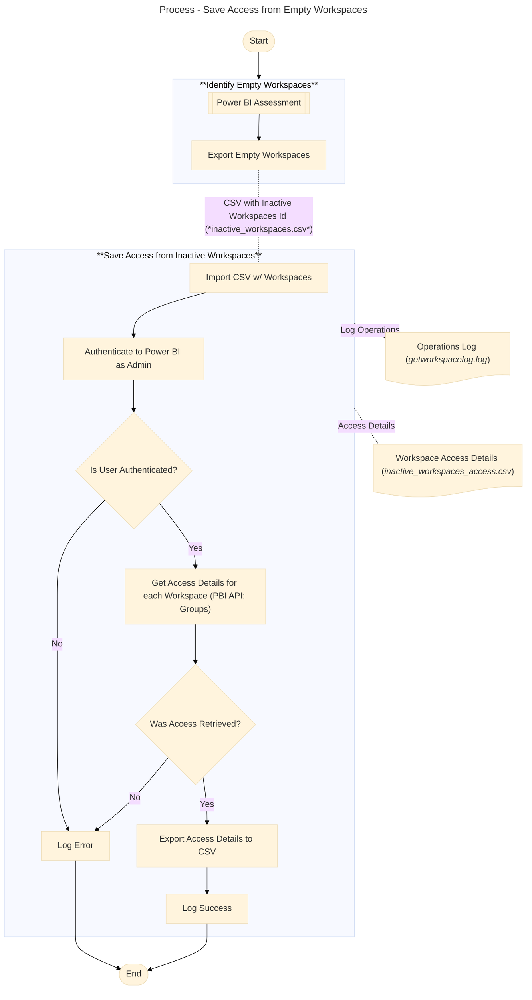

# Backup Workspace Current User Accesses 
This PowerShell script can be used to save a backup of user assignment's on workspaces from Fabric environment. This can help in regular clean up routines or ad-hoc removal, helping to understand who has access to the workspace to be able to restore access if the workspace will become active again.

### Pre-Requirements
To run this script you need: 
- A **list of IDs of workspaces** from which the user accesses will be saved to a CSV file. The workspace list with Workspace IDs can be created manually or obtained through a previous assessment, which is not part of the scope of current script;
- **Powershell 5.1** (or more recent);
- The **_MicrosoftPowerBIMgmt_** installed in PowerShell. You can install it using the following command if it's not already installed:
 ```powershell
 Install-Module -Name MicrosoftPowerBIMgmt -Scope CurrentUser
 ```
- An user with **Fabric Administrator** privileges.

### Overview
The following diagram demonstrates the overall workspace access backup process. The steps demonstrated in the **"Save Access from Inactive Workspaces"** are implemented in this script:



### Script Inputs and Outputs
- **Input**: 
-- **`inactive_workspaces.csv`**: a list of workspace IDs from which access details will be saved. See format example on `inactive_workspaces (SAMPLE).csv`.
- **Output**:
-- **`<timestamp>_inactive_workspace_access.csv`**: outputs the list of workspaces with corresponding access. The list will include all principals (Users, Groups, Service Principal) and corresponding access in the workspace (Admin, Viewer, Contributor, etc). See example on `inactive_workspaces_access (SAMPLE).csv`;
-- **`<timestamp>_getworkspacelog.log`**: A log with main script steps execution process. Use it to troubleshoot execution. See example in `getworkspacelog (SAMPLE).log`.   


### Important
This script will save current access to workspaces only. It's important to check if user's has shared access to workspace item's directly, which is not part of the scope of this script.