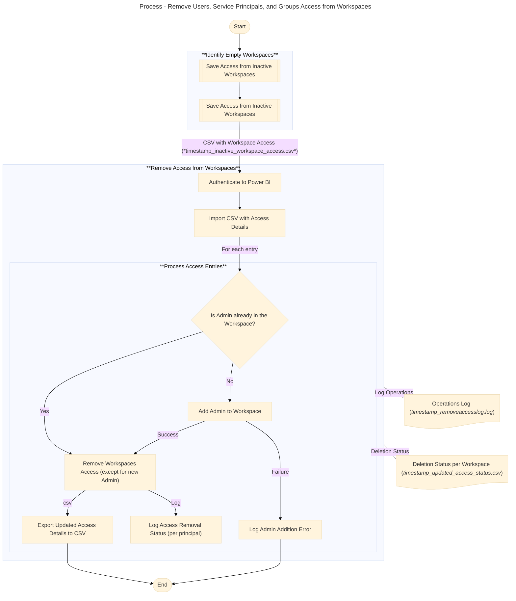

# Remove Accesses from Workspaces
This PowerShell script can be used to remove user's access from a workspace. The script will first add a new admin to the workspace to avoid it to become "orphaned" and then will remove each user, group and service principal access of this workspace. As a input, this script must use the csv file output from script `GetAccessInactiveWorkspaces.ps1`.

This script is meant to be used as part of clean up routines, for example, temporarily removing user access from the workspace before eliminating then definitively. You can use script `RestoreWorkspaceAcccess.ps1` to restore access to the workspace in case of user's request to revert effects from current script execution.  

### Pre-Requirements
To run this script you need: 
- A csv file with **worspaces ids and user access** from a previous backup. See **inputs** below for more details;
- **Powershell 5.1** (or more recent);
- The **_MicrosoftPowerBIMgmt_** installed in PowerShell. You can install it using the following command if it's not already installed:
 ```powershell
 Install-Module -Name MicrosoftPowerBIMgmt -Scope CurrentUser
 ```
- An user with **Fabric Administrator** privileges.

### Overview
The following diagram demonstrates the overall process to remove access from the workspaces. The steps demonstrated in the **"Remove Access from Workspaces"** are implemented in this script:



### Script Inputs and Outputs
- **Input**: 
-- **`<timestamp>_inactive_workspace_access.csv`**: the list of workspaces with corresponding access. The list will includes principals (Users, Groups, Service Principal) and corresponding access in the workspace (Admin, Viewer, Contributor, etc). See example on `inactive_workspaces_access (SAMPLE).csv`;
- **Output**:
-- **`<timestamp>_updated_access_status.csv`**: outputs the list of workspaces with corresponding user access and access removal status. Principals that were removed will appear as "Removed", while issues in processing a removal will appear as "Not Removed" with a description of the reason. See example on `updated_access_status (SAMPLE).csv`;
-- **`<timestamp>_removeaccesslog.log`**: A log with main script steps execution process. Use it to troubleshoot execution. See example in `removeaccesslog (SAMPLE).log`.   

### Important
This script will remove access to the workspaces only. It's important to check if there are other access directly to workspace items, like Reports and Semantic models, but this is not part of the scope of this script as the focus of the clean up process is targeting empty workspaces.