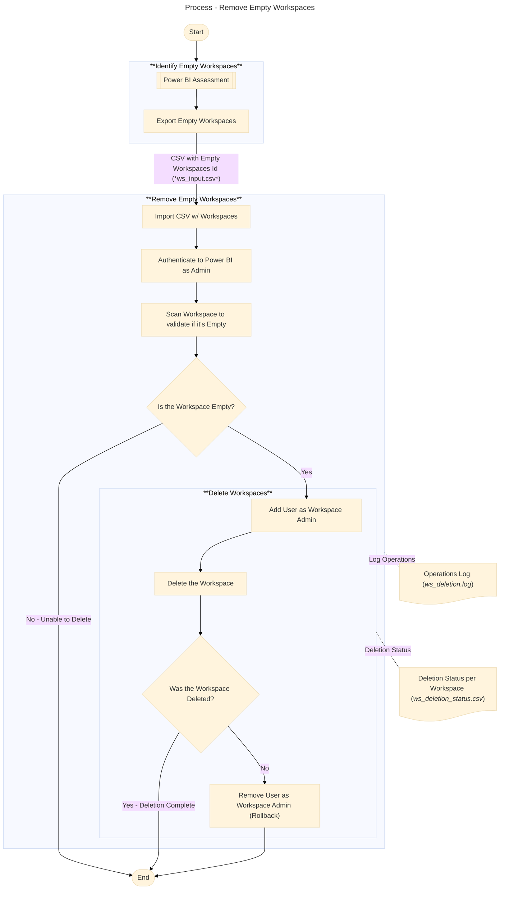

# Remove Empty Workspaces
This PowerShell script can be used to eliminate empty workspaces from Fabric environment. This can help in regular clean up routines or ad-hoc removal.

### Pre-Requirements
To run this script you need: 
- A **list of IDs of empty workspaces** to be removed (obtained via a previous assessment, not part of the scope of current script);
- **Powershell 5.1** (or more recent);
- The **_MicrosoftPowerBIMgmt_** installed in PowerShell. You can install it using the following command if it's not already installed:
 ```powershell
 Install-Module -Name MicrosoftPowerBIMgmt -Scope CurrentUser
 ```
- An user with **Fabric Administrator** privileges.

### Overview
The following diagram demonstrates the overall clean up process. The steps demonstrated in the **"Remove Empty Workspaces"** are implemented in this script:



### Important
Before running this or any other script that may remove content from Fabric, it's important to verify **Worspace Retention** configuration and increase the retention time according to your organization's policies for data retention. 
See this link for more information on how to configure [Workspace Retention in Fabric](https://learn.microsoft.com/en-us/fabric/admin/portal-workspaces#workspace-retention)
