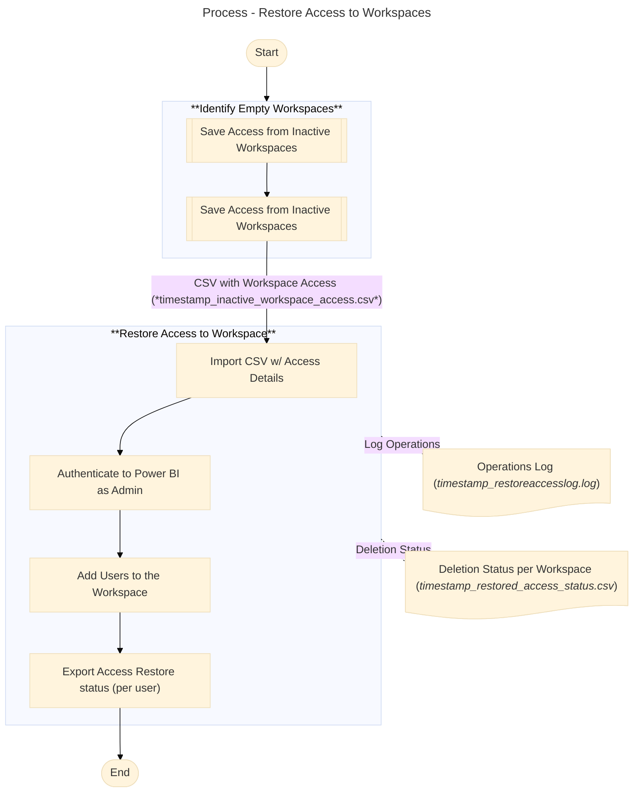

# Restore Workspace User Accesses from Backup 
This PowerShell script can be used to restore access to Workspaces in Fabric from a backup of user assignments that has been previously exported using `GetAccessInactiveWorkspace.ps1` script. This script can help to restore access to user if the workspace will become active again.

### Pre-Requirements
To run this script you need: 
- A csv file with **worspaces ids and user access** from a previous backup. See **inputs** below for more details;
- **Powershell 5.1** (or more recent);
- The **_MicrosoftPowerBIMgmt_** installed in PowerShell. You can install it using the following command if it's not already installed:
 ```powershell
 Install-Module -Name MicrosoftPowerBIMgmt -Scope CurrentUser
 ```
- An user with **Fabric Administrator** privileges.

### Overview
The following diagram demonstrates the overall process to restore access to the workspaces from a previously done backup. The steps demonstrated in the **"Restore Access to Workspaces"** are implemented in this script:



### Script Inputs and Outputs
- **Input**: 
-- **`<timestamp>_inactive_workspace_access.csv`**: the list of access saved in the past as a backup containing a snapshot of user access to the workspaces before access removal (result of script `GetAccessInactiveWorkspace.ps1`). The list will include all principals (Users, Groups, Service Principal) and corresponding access in the workspace (Admin, Viewer, Contributor, etc). See example on `inactive_workspaces_access (SAMPLE).csv`. If you want to restore the access to a single workspace, ensure you review to keep only applicable workspace ids.
- **Output**:
-- **`<timestamp>_restored_access_status.csv`**: outputs the list of workspaces with corresponding access and the status of Access Restore operation in Power BI. The list will include all the fields from the input file and a status regarding the Add User API call. See example on `restored_access_status (SAMPLE).csv`;
-- **`<timestamp>_restoreaccesslog.log`**: A log with main script steps execution process. Use it to troubleshoot the execution. See example in `restoreaccesslog (SAMPLE).log`.   


### Important
Please ensure that you only keep in the input the list of workspaces you would like to restore access to from the backup file. At the end of the execution, review the script to validate that all users access were correctly restored in the workspace. 